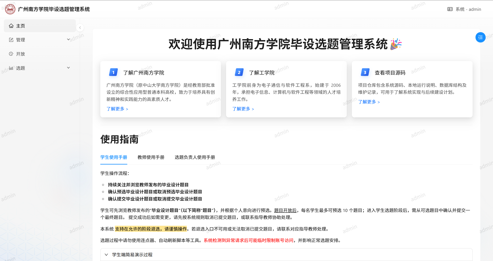
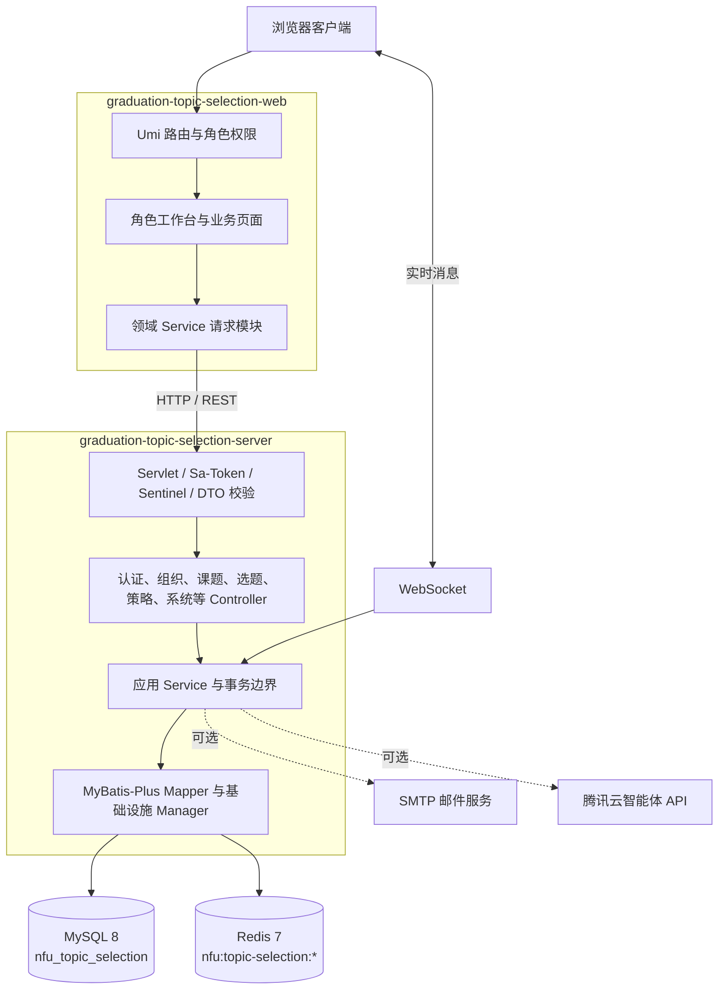

# 广州南方学院毕设选题管理系统

<div align="center">
  <strong>NCG Graduation Topic Selection System</strong>
  <br />
  面向高校毕业设计选题全流程的前后端分离管理系统（NCG Topic Selection）
</div>

<p align="center">
  <a href="https://github.com/Lq0412/nfu-graduation-topic-selection">项目主页</a>
  ·
  <a href="https://github.com/Lq0412/nfu-graduation-topic-selection/issues">问题反馈</a>
  ·
  <a href="./TODO.md">开发计划</a>
</p>

<p align="center">
  
  
  
  
  
</p>
## 项目简介

**广州南方学院毕设选题管理系统**（**NCG Graduation Topic Selection System**，简称 **NCG Topic Selection**）是一套面向高校院系毕业设计选题场景的 Web 管理系统。项目采用前后端分离的单体仓库结构：前端通过 Umi Max 路由与权限模型向不同客户端角色开放对应工作台，后端通过 Spring MVC Controller、应用服务、MyBatis-Plus Mapper 与基础设施管理器承载认证、组织、课题、选题和系统配置能力。

系统重点解决以下问题：

- 使用统一的组织与账号模型维护学院、专业、选题组及四类客户端角色；
- 将课题维护、审核、开放时间、预选、正式确认和结果查询拆分为独立接口与前端页面；
- 通过角色路由、接口鉴权和对象级业务校验控制不同客户端能够访问的数据与操作；
- 使用事务、悲观锁、唯一约束和缓存策略保护选题名额与状态一致性；
- 提供数据导入导出、实时通知、运行状态展示以及可选的邮件和 AI 扩展能力；
- 在公开仓库中隔离真实名单、账号和服务凭据，便于教学演示、功能验证与二次开发。

> **项目定位**：本项目适合高校院系教学演示、毕业设计流程管理与功能二次开发。仓库不提供可直接登录的公开账号，公网生产环境部署请配合 [deploy/README.md](./deploy/README.md) 完成安全配置与加固。

## 工程命名与技术标识

仓库已完成 Maven 多模块、Java 根包、前端工程与运行时基础设施的统一命名：

| 对象 | 名称 / 标识 | 物理目录 / 说明 |
| --- | --- | --- |
| 中文项目名 | 广州南方学院毕设选题管理系统 | — |
| 英文项目名 | NCG Graduation Topic Selection System | — |
| 项目简称 | NCG Topic Selection | — |
| Git 仓库名 | `nfu-graduation-topic-selection` | 单体仓库（Monorepo） |
| Maven `groupId` | `cn.edu.nfu` | 统一组织坐标 |
| Java 根包名 | `cn.edu.nfu.topicselection` | 生产代码、单元测试与集成测试统一命名空间 |
| Maven 父工程 | `graduation-topic-selection-parent` | 根目录 `pom.xml`（版本 `1.0.0-SNAPSHOT`） |
| 后端可执行模块 | `graduation-topic-selection-server` | 对应目录 `nfu-graduation-topic-selection-backend/` |
| 集成测试模块 | `graduation-topic-selection-integration-tests` | 对应目录 `integration-tests/` |
| 前端工程名 | `graduation-topic-selection-web` | 对应目录 `nfu-graduation-topic-selection-frontend/` |
| Spring 应用名 | `nfu-topic-selection` | `spring.application.name` |
| Java 启动类 | `TopicSelectionApplication` | `cn.edu.nfu.topicselection.TopicSelectionApplication` |
| 数据库名 | `nfu_topic_selection` | MySQL 8.x 默认库名 |
| Sa-Token Cookie | `nfu-topic-selection` | `sa-token.token-name` |
| 缓存全局前缀 | `nfu:topic-selection:` | Redis / Caffeine 统一键前缀（查询缓存键为 `nfu:topic-selection:search:*`） |
| 生产反向代理前缀 | `/api` | Caddy 将 `/api/*` 转发至后端 `topic-selection-server:8000` |
| Docker 镜像名 | `nfu-topic-selection-server`、`nfu-topic-selection-web` | 本地构建标签默认为 `:local` |

## 界面预览




## 核心功能

### 按客户端角色开放对应的功能

| 客户端角色 | 开放页面与功能 |
| --- | --- |
| **学生端（student）** | 浏览符合本人学院、专业和选题组范围的教师与课题；预选或取消预选；在开放阶段提交最终课题；查看当前选题状态，并在系统规则允许时申请退选。 |
| **教师端（teacher）** | 新增、编辑、删除和提交课题；配置课题所属选题组与可接收人数；使用可选的 AI 辅助检查；查看选择本人课题的学生，并进入指定学生等二级操作页面。 |
| **选题负责人端（topic_leader）** | 审核所属范围内的课题并填写通过或退回意见；查看院系选题统计、学生与课题明细；导出结果；满足资格时可切换至教师角色参与出题。 |
| **系统管理端（admin）** | 管理学院、专业、选题组和四类账号；设置教师出题额度与学生预选策略；控制课题开放和取消发布；配置跨学院选题、查看权限、单选模式及系统锁；查看全局统计并执行批量导入导出。 |

### 架构能力

- **角色化客户端入口**：Umi Max 的 routes.ts 与 access.ts 根据 student、teacher、topic_leader、admin 四类角色过滤菜单、页面和二级路由；后端继续使用 Sa-Token 注解执行接口级鉴权。
- **领域接口拆分**：前后端按认证、组织结构、教师选题组、课题维护、课题查询、学生选题、选题策略和系统管理拆分 Controller 与 Service，避免继续把全部用户领域能力集中在单一模块。
- **结构化操作反馈**：批量发布、取消发布等操作返回可识别的结果数据，前端根据成功、部分跳过和全部跳过状态展示具体原因，并通过局部刷新保持页面状态。
- **选题一致性保护**：正式选题、教师指定学生和退选等关键操作结合 Spring 事务、数据库锁、唯一约束与状态校验，降低重复选择、名额超卖和并发覆盖风险。
- **组织与选题组约束**：学院、专业、选题组和教师配额共同限定课题适用范围；跨学院选择由系统策略和允许范围配置共同控制。
- **批量处理与统计**：提供学生、教师和课题数据模板、CSV 导入导出、角色范围内的选题统计与明细查询。
- **实时与可选扩展**：WebSocket 用于系统消息和状态通知；SMTP 邮件与腾讯云智能体 API 为可选能力，未配置时不阻塞核心功能。
- **安全与运行保护**：使用 BCrypt、Sa-Token、Sentinel、验证码与一次性凭证、Redis 会话、Caffeine 查询缓存和统一异常响应保护系统访问与运行稳定性。

## 系统架构



- **前端（`graduation-topic-selection-web`）**：使用 React、TypeScript、Umi Max 与 Ant Design Pro Components 构建客户端；路由权限负责页面可见性，`src/services/topic-selection/` 按后端领域接口组织请求。本地开发访问 `http://127.0.0.1:8000`，生产环境统一通过 `/api` 反向代理。
- **后端（`graduation-topic-selection-server`）**：Spring MVC 接收请求，Sa-Token、Sentinel 与请求 DTO 校验切面处理认证、授权、限流和基础参数约束；Controller 调用应用 Service，事务与业务规则在服务层执行，Mapper 和 Manager 负责数据库、缓存、WebSocket 与外部服务访问。
- **数据层**：MySQL 保存组织、账号、课题、选题关系及组选题额度；Redis 保存 Sa-Token 会话、验证码、一次性凭证和系统开关；Caffeine 为高频查询提供进程内缓存。
- **测试模块（`graduation-topic-selection-integration-tests`）**：作为独立 Maven 子模块，使用 Testcontainers 启动 MySQL 8 和 Redis 7，覆盖应用启动、认证、课题生命周期、选题并发、事务回滚与 Knife4j 文档契约。
- **部署层**：后端构建可执行 Jar 与服务镜像，前端构建静态资源与 Caddy 镜像；`deploy/` 使用 Docker Compose 组织前端、后端、MySQL、Redis 和生产反向代理。

## 技术栈

| 层次 | 技术 |
| --- | --- |
| 前端 | React 18、Umi Max 4、Ant Design 5、Ant Design Pro Components、TypeScript 5、ECharts 6 |
| 后端 | Java 8、Spring Boot 2.5.6、Spring MVC、MyBatis-Plus 3.5.2、Sa-Token 1.42.0、Sentinel 1.8.6 |
| 数据与缓存 | MySQL 8.0、Redis 7、Caffeine 2.9 |
| 接口与文件 | Knife4j / OpenAPI 2（4.4.0）、Apache Commons CSV、EasyExcel |
| 测试体系 | JUnit 5、Spring Boot Test、H2（单元测试 `test`）、Testcontainers 1.19.8（集成测试 `integration`）、Jest |
| 实时与扩展 | Spring WebSocket、Spring Mail（SMTP）、腾讯云智能体 API |
| 构建与部署 | Maven Wrapper、pnpm 11.19.0、Docker、Docker Compose v2、Caddy 2.10 |

## 仓库结构

```text
nfu-graduation-topic-selection/
├── pom.xml                                        # Maven 父工程 (cn.edu.nfu:graduation-topic-selection-parent)
├── mvnw                                           # Linux / macOS Maven Wrapper
├── mvnw.cmd                                       # Windows Maven Wrapper
├── .mvn/                                          # Maven Wrapper 配置
├── nfu-graduation-topic-selection-backend/        # Spring Boot 后端模块 (graduation-topic-selection-server)
│   ├── pom.xml                                    # 后端模块 POM（生成普通 Jar 与 -exec.jar）
│   ├── Dockerfile                                 # 后端生产容器构建文件（复制 *-exec.jar）
│   ├── src/main/java/cn/edu/nfu/topicselection/   # 控制器、服务、AOP、安全限流与基础设施
│   ├── src/main/resources/                        # application*.yaml、MyBatis Mapper XML 与 SQL 脚本
│   │   └── sql/                                   # schema.sql（完整基线）、demo-data.sql、migration-template.sql
│   └── src/test/                                  # 快速单元测试与 H2 测试资源 (test profile)
├── integration-tests/                             # 后端集成与接口文档测试模块 (graduation-topic-selection-integration-tests)
│   ├── pom.xml                                    # Failsafe 集成测试配置 (integration profile)
│   └── src/test/java/cn/edu/nfu/topicselection/integration/
│       ├── support/                               # Testcontainers 基类、API 客户端、数据清理与断言工具
│       ├── smoke/                                 # ApplicationSmokeIT 上下文与容器连接冒烟测试
│       ├── documentation/                         # Knife4jDocumentationIT 运行时路由与 OpenAPI 契约测试
│       ├── auth/                                  # AuthenticationFlowIT 认证与会话流测试
│       ├── topic/                                 # TopicLifecycleIT 题目全生命周期测试
│       └── selection/                             # 选题流程、并发争抢 (Concurrency) 与事务回滚 (Rollback) 测试
├── nfu-graduation-topic-selection-frontend/       # React + Umi 前端工程 (graduation-topic-selection-web)
│   ├── package.json                               # 前端依赖与脚本定义
│   ├── Caddyfile                                  # 独立容器静态服务与 /api/* 反代配置
│   ├── Dockerfile                                 # 前端 Caddy 容器构建文件
│   ├── config/                                    # 路由、构建配置与默认布局
│   ├── public/templates/                          # 学生、教师、题目 CSV 导入模板
│   ├── public/steps/                              # 学生、教师、专业负责人使用手册
│   └── src/                                       # 页面、组件与后端服务调用 (src/services/topic-selection/)
├── deploy/                                        # 生产环境 Docker Compose 编排、Caddyfile 与数据库备份脚本
├── docs/                                          # 架构演进、接口重构状态与 Maven 命名重构方案文档
├── .env.example                                   # 本地开发环境变量模板
├── env.sh                                         # Bash 环境变量导出脚本 (source ./env.sh)
├── env.ps1                                        # PowerShell 环境变量导出脚本 (. .\env.ps1)
├── build.sh                                       # 本地构建前后端 Docker 镜像脚本
├── AGENTS.md                                      # 仓库级 AI 协作入口与开发规范索引
├── TODO.md                                        # 已完成整改、验证结果和后续计划
├── LICENSE                                        # MIT License
└── README.md                                      # 项目说明
```

## 快速开始

### 1. 准备环境

建议使用以下开发环境：

- **JDK**：1.8；
- **MySQL**：8.x；
- **Redis**：6.x / 7.x；
- **Node.js**：24.x；
- **pnpm**：11.19.0；
- **Docker Desktop / Compose v2**：用于运行 `integration-tests`（Testcontainers）及构建容器镜像。

仓库根目录已内置 Maven Wrapper（`mvnw` / `mvnw.cmd`），无需单独安装全局 Maven。

### 2. 获取代码

```bash
git clone https://github.com/Lq0412/nfu-graduation-topic-selection.git
cd nfu-graduation-topic-selection
```

### 3. 创建并初始化数据库

使用 MySQL 客户端创建 `nfu_topic_selection` 数据库：

```sql
CREATE DATABASE IF NOT EXISTS `nfu_topic_selection`
  CHARACTER SET utf8mb4
  COLLATE utf8mb4_0900_ai_ci;
```

导入公开表结构基线（`schema.sql`）：

```bash
mysql -u YOUR_MYSQL_USER -p nfu_topic_selection \
  < nfu-graduation-topic-selection-backend/src/main/resources/sql/schema.sql
```

PowerShell 下可使用：

```powershell
Get-Content -Raw "nfu-graduation-topic-selection-backend/src/main/resources/sql/schema.sql" |
  mysql -u YOUR_MYSQL_USER -p nfu_topic_selection
```

如需本地演示数据，可单独导入工学院示例数据（集成测试只加载 `schema.sql`，不加载 `demo-data.sql`）：

```bash
mysql -u YOUR_MYSQL_USER -p nfu_topic_selection \
  < nfu-graduation-topic-selection-backend/src/main/resources/sql/demo-data.sql
```

> **说明**：`demo-data.sql` 中的学院、专业及教师姓名来自学校官网公开页面，其余身份信息均为虚构；演示账号统一使用初始密码 `12345678`，只能用于本地开发环境。首次启动时，若数据库中尚无管理员账号，可通过 `.env` 中的引导变量一次性创建初始管理员（见下一节）。当前项目以 `schema.sql` 作为完整数据库基线；后续如需对已有数据的环境做表结构升级，请复制 `nfu-graduation-topic-selection-backend/src/main/resources/sql/migration-template.sql` 编写增量迁移，同时将最终表结构同步至 `schema.sql`。

### 4. 配置环境变量

复制根目录环境变量模板：

```bash
cp .env.example .env
```

编辑 `.env`，根据本地环境填写数据库连接与凭据：

- `SPRING_DATASOURCE_URL`（默认 `jdbc:mysql://127.0.0.1:3306/nfu_topic_selection`）
- `SPRING_DATASOURCE_USERNAME`
- `SPRING_DATASOURCE_PASSWORD`
- 如 Redis 设置了密码，填写 `SPRING_REDIS_PASSWORD`

#### 自动加载与终端导出

后端主配置 `nfu-graduation-topic-selection-backend/src/main/resources/application.yaml` 已配置 `spring.config.import`，支持在启动时自动按序加载 `optional:file:../.env[.properties]` 与 `optional:file:./.env[.properties]`（无需在 `.env` 中声明 `SPRING_PROFILES_ACTIVE`，本地默认激活 `develop` Profile）。

如果你希望将 `.env` 显式导入当前终端会话的环境变量中，也可以使用仓库内置脚本：

- **macOS / Linux / Git Bash / WSL**：

  ```bash
  source ./env.sh
  ```

- **Windows PowerShell**（使用点调用 `.` 写入当前进程环境变量）：

  ```powershell
  . .\env.ps1
  ```

#### 初始化管理员（可选）

如果数据库中没有任何管理员，可以在 `.env` 中同时填写：

```dotenv
APP_BOOTSTRAP_ADMIN_ACCOUNT=admin
APP_BOOTSTRAP_ADMIN_NAME=系统管理员
APP_BOOTSTRAP_ADMIN_PASSWORD=replace-with-a-long-random-password
```

后端仅在管理员数量为零时创建一次，并使用 BCrypt 保存密码散列。首次登录后请立即修改密码，并清空 `.env` 中的上述三个引导变量。

### 5. 启动后端

在仓库根目录执行：

- **Windows PowerShell**：

  ```powershell
  .\mvnw.cmd -pl nfu-graduation-topic-selection-backend spring-boot:run
  ```

- **macOS / Linux / Git Bash / WSL**：

  ```bash
  ./mvnw -pl nfu-graduation-topic-selection-backend spring-boot:run
  ```

也可以进入后端目录启动：

```powershell
Push-Location nfu-graduation-topic-selection-backend
..\mvnw.cmd spring-boot:run
Pop-Location
```

启动后默认地址：

- **后端 API**：<http://127.0.0.1:8000>
- **连通性检查**：<http://127.0.0.1:8000/user/test>
- **Knife4j 接口文档**：<http://127.0.0.1:8000/doc.html>
- **OpenAPI 2 JSON**：<http://127.0.0.1:8000/v2/api-docs>

### 6. 启动前端

打开新终端，安装依赖并启动前端开发服务：

- **Windows PowerShell**：

  ```powershell
  pnpm --dir nfu-graduation-topic-selection-frontend install --frozen-lockfile
  $env:PORT = '3000'
  $env:HOST = '127.0.0.1'
  pnpm --dir nfu-graduation-topic-selection-frontend start:dev
  ```

- **macOS / Linux / Git Bash / WSL**：

  ```bash
  pnpm --dir nfu-graduation-topic-selection-frontend install --frozen-lockfile
  pnpm --dir nfu-graduation-topic-selection-frontend dev
  ```

默认前端访问地址：<http://127.0.0.1:3000>

本地开发时，前端通过 `127.0.0.1:8000` 或 `localhost:8000` 访问后端并携带 `nfu-topic-selection` Cookie。若修改了端口或前端访问源，请同步调整 `.env` 中的 `SERVER_PORT`、`APP_CORS_ALLOWED_ORIGINS` 和 `APP_WEBSOCKET_ALLOWED_ORIGINS`。

## 数据导入与导出

管理员可以在系统中使用 CSV 完成批量数据处理。仓库提供以下公开模板：

- [学生账号导入模板](./nfu-graduation-topic-selection-frontend/public/templates/student-import.csv)
- [教师账号导入模板](./nfu-graduation-topic-selection-frontend/public/templates/teacher-import.csv)
- [题目导入模板](./nfu-graduation-topic-selection-frontend/public/templates/topic-import.csv)

> 当前公开前端页面仅保留学生和教师账号导入入口；题目模板作为字段示例保留，是否启用题目批量导入请以实际页面和后端接口为准。

使用导入功能时请注意：

1. 严格按照模板的列顺序和字段格式填写；
2. 删除模板中的示例行后再上传；
3. 学生和教师账号必须设置不同的临时密码，系统只保存 BCrypt 密码散列；
4. 不要将真实名单、账号密码或历史数据库文件提交到 Git；
5. 导出文件已做 CSV 公式注入防护，但仍可能包含业务数据，请按学校或院系的数据管理要求保存和传递。

## 检查、测试与构建

### 后端单元测试与集成测试

项目将快速单元测试（Surefire，`test` Profile，使用 H2）与真实容器集成测试（Failsafe，`integration` Profile，使用 Testcontainers 启动 MySQL 8 与 Redis 7）物理隔离。在仓库根目录执行：

```powershell
# 1. 仅运行后端单元测试（Surefire, test profile，无需 Docker）
.\mvnw.cmd test

# 2. 打包后端普通 Jar 与可执行 -exec.jar（跳过测试）
.\mvnw.cmd -pl nfu-graduation-topic-selection-backend -am clean package -DskipTests

# 3. 完整编译打包但跳过集成测试
.\mvnw.cmd verify -DskipITs

# 4. 执行全量单元测试 + Testcontainers 集成测试与 Knife4j 文档契约测试（需 Docker Desktop 运行中）
.\mvnw.cmd verify
```

后端模块打包后会在 `nfu-graduation-topic-selection-backend/target/` 下同时生成：

- `graduation-topic-selection-server-1.0.0-SNAPSHOT.jar`：普通 Jar，供 `integration-tests` 模块作为测试依赖；
- `graduation-topic-selection-server-1.0.0-SNAPSHOT-exec.jar`：Spring Boot 可执行 Jar（`classifier=exec`），供 Docker 镜像和 `java -jar` 直接运行使用。

### 前端检查与构建

在仓库根目录执行：

```powershell
pnpm --dir nfu-graduation-topic-selection-frontend install --frozen-lockfile
pnpm --dir nfu-graduation-topic-selection-frontend tsc
pnpm --dir nfu-graduation-topic-selection-frontend lint:js
pnpm --dir nfu-graduation-topic-selection-frontend exec prettier --check "src/**/*.{js,jsx,ts,tsx,less}"
pnpm --dir nfu-graduation-topic-selection-frontend exec jest --runInBand
pnpm --dir nfu-graduation-topic-selection-frontend build
```

也可以直接运行聚合检查命令：

```powershell
pnpm --dir nfu-graduation-topic-selection-frontend lint
pnpm --dir nfu-graduation-topic-selection-frontend test
```

### 构建 Docker 镜像与部署验证

在 Git Bash / WSL / Linux 下可直接运行根目录构建脚本：

```bash
./build.sh
```

或在 PowerShell 下分步执行并校验 Docker Compose 配置：

```powershell
.\mvnw.cmd -pl nfu-graduation-topic-selection-backend -am clean package -DskipTests
pnpm --dir nfu-graduation-topic-selection-frontend build
docker build -t nfu-topic-selection-server:local nfu-graduation-topic-selection-backend
docker build -t nfu-topic-selection-web:local nfu-graduation-topic-selection-frontend
docker compose --env-file deploy/.env.production.example -f deploy/docker-compose.yml config
```

生产环境 Compose 编排包含 `topic-selection-server`、`topic-selection-web`、`topic-selection-mysql` 与 `topic-selection-redis` 四个服务，以及 `topic-selection-mysql-data`、`topic-selection-redis-data`、`topic-selection-caddy-data`、`topic-selection-caddy-config` 四个持久化卷；数据库备份脚本 `deploy/backup.sh` 生成 `nfu_topic_selection-<timestamp>.sql.gz`。

完整的公网生产部署指南（HTTPS 自动签发、容器网络、首次建库与备份恢复）请参见 [deploy/README.md](./deploy/README.md)。

## 配置说明

| 配置项 | 作用 | 是否必需 |
| --- | --- | --- |
| `SPRING_DATASOURCE_URL` | MySQL JDBC 连接地址（默认库名 `nfu_topic_selection`） | 是 |
| `SPRING_DATASOURCE_USERNAME` / `PASSWORD` | MySQL 认证账号与密码 | 是 |
| `SPRING_REDIS_HOST` / `PORT` / `DATABASE` / `PASSWORD` | Redis 连接信息 | 是 |
| `SERVER_ADDRESS` / `SERVER_PORT` | 后端监听地址和端口（默认 `127.0.0.1:8000`） | 否，有默认值 |
| `APP_CORS_ALLOWED_ORIGINS` | REST 请求允许的跨域来源 | 本地开发建议配置 |
| `APP_WEBSOCKET_ALLOWED_ORIGINS` | WebSocket 允许的来源 | 本地开发建议配置 |
| `APP_BOOTSTRAP_ADMIN_*` | 一次性初始化系统管理员账号、姓名与密码 | 否 |
| `SPRING_MAIL_*` | SMTP 邮件验证码和通知服务 | 否 |
| `TXY_BOT_APP_KEY` | 腾讯云智能体 AI 题目辅助检查服务 | 否 |

> **注意**：仓库根目录 `.env` 供本地开发启动读取，而 `deploy/.env`（由 `deploy/.env.production.example` 复制）供 Docker Compose 生产容器编排插值使用，请勿将本地 `127.0.0.1` 数据库地址直接复制进容器生产配置。

## 安全与隐私

- 仓库只保留公开表结构（`schema.sql`）和本地演示数据（`demo-data.sql`）；其中学院、专业及教师姓名取自官网公开页面，账号、邮箱、学生名单和题目均为虚构，不包含真实凭据、私有 SQL、操作截图或生产数据；
- `.env`、`deploy/.env`、构建产物、缓存和本地私有资料已加入 `.gitignore`；
- 密码统一使用 BCrypt 保存，支持旧版存量散列在成功登录后平滑迁移；
- 认证接口与关键写操作按 Sentinel 限流（`-300`）、Sa-Token 鉴权（`-200`）、DTO 基础校验（`-100`）顺序执行横切保护，选题操作结合事务、悲观锁与唯一约束保障并发一致性；
- 生产环境（`release` Profile）默认关闭 Knife4j 接口文档（`knife4j.enable=false`），避免暴露内部接口结构；
- 提交前建议检查待提交文件：

```bash
git add -n .
```

## 使用手册

系统内置了面向不同角色的简明手册：

- [学生使用手册](./nfu-graduation-topic-selection-frontend/public/steps/1.学生使用手册.md)
- [教师使用手册](./nfu-graduation-topic-selection-frontend/public/steps/2.教师使用手册.md)
- [专业负责人使用手册](./nfu-graduation-topic-selection-frontend/public/steps/3.专业负责人使用手册.md)

## 常见问题

### 1. 为什么复制 `.env` 后环境变量没有在当前终端生效？

Spring Boot 启动时会通过 `spring.config.import` 自动读取当前目录或父目录的 `.env` 文件；但如果你需要在终端命令（如 `mysql` CLI）中直接引用 `$env:SPRING_DATASOURCE_USERNAME` 等变量，请在当前终端执行 `source ./env.sh`（Bash）或 `. .\env.ps1`（PowerShell）。

### 2. 为什么前端访问不到后端或登录态失效？

请确认后端正在监听 `8000` 端口，并检查 `.env` 中的 `APP_CORS_ALLOWED_ORIGINS` 与 `APP_WEBSOCKET_ALLOWED_ORIGINS` 是否包含当前前端访问地址。本地访问时建议统一使用 `http://127.0.0.1:3000` 或统一使用 `http://localhost:3000`，以保证 `nfu-topic-selection` Cookie 正常携带。

### 3. 为什么运行 `.\mvnw.cmd verify` 时报错连接不上 Docker？

`verify` 生命周期会运行 `integration-tests` 模块中的 Testcontainers 集成测试（自动拉起 `mysql:8.0` 与 `redis:7-alpine` 容器）。若本机未启动 Docker Desktop，请先启动 Docker Desktop，或使用 `.\mvnw.cmd test` / `.\mvnw.cmd verify -DskipITs` 仅执行单元测试与构建。

### 4. 仓库有公开演示账号吗？

没有。为避免凭据泄露，仓库不提供可直接登录的账号。请按“初始化管理员”说明在 `.env` 中配置引导账号，或使用管理员批量导入功能导入测试数据。

## 相关文档

- [AGENTS.md](./AGENTS.md)：项目级上下文、前后端架构事实与协作边界说明；
- [deploy/README.md](./deploy/README.md)：Docker Compose 公网生产部署、数据库备份与恢复说明；
- [docs/phase-00-planning/MAVEN_PROJECT_NAMING_REFACTOR_PLAN.md](./docs/phase-00-planning/MAVEN_PROJECT_NAMING_REFACTOR_PLAN.md)：Maven 工程命名与模块化重构实施计划；
- [docs/phase-00-planning/HTTP_API_REFACTOR_STATUS.md](./docs/phase-00-planning/HTTP_API_REFACTOR_STATUS.md)：79 个 HTTP 接口重构与契约台账；
- [TODO.md](./TODO.md)：安全整改、测试验证与后续开发计划。

## 来源与许可证

本项目基于 [limou3434/work-topic-selection](https://github.com/limou3434/work-topic-selection) 整理并继续开发，源码中的原作者标注予以保留。

原项目声明 MIT License，本仓库据此保留 [LICENSE](./LICENSE)。本项目仅供学习、研究和二次开发使用；在实际院系或学校环境部署前，请根据组织的数据安全、账号管理和运维规范进行评估与加固。
