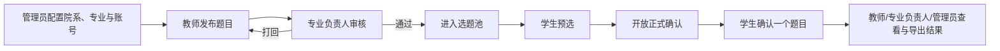
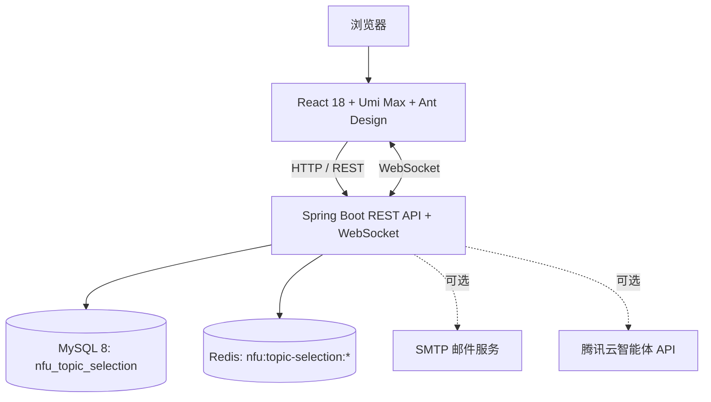

# 广州南方学院毕业选题管理系统

<div align="center">
  <strong>NCG Graduation Topic Selection System</strong>
  <br />
  面向高校毕业设计选题全流程的前后端分离管理系统（NCG Topic Selection）
</div>

<p align="center">
  <a href="https://github.com/Lq0412/nfu-graduation-topic-selection">项目主页</a>
  ·
  <a href="https://github.com/Lq0412/nfu-graduation-topic-selection/issues">问题反馈</a>
  ·
  <a href="./TODO.md">开发计划</a>
</p>

<p align="center">
  
  
  
  
  
</p>

> 将“组织配置 → 题目发布 → 系部审核 → 学生预选 → 开放确认 → 结果统计”串成一个可追踪、可管理的选题闭环。

## 项目简介

广州南方学院毕业选题管理系统（NCG Graduation Topic Selection System）是一套面向高校院系场景的 Web 管理系统，采用前后端分离与 Maven 多模块架构，为学生、教师、专业负责人和系统管理员提供不同的业务工作台。

系统重点解决以下问题：

- 统一维护院系、专业、选题组和用户账号等基础数据；
- 将题目发布、审核、开放时间和学生选题过程集中管理；
- 支持“预选 → 正式确认”的分阶段选题流程，并处理并发选题；
- 通过统计面板、CSV 导入/导出和实时通知减少人工沟通成本；
- 在公开代码仓库中隔离真实名单、账号和服务凭据，便于学习、演示和二次开发。

## 界面预览


> 截图来自仓库内置前端页面，仅用于展示系统布局和交互风格。

## 核心功能

### 按角色划分

| 角色 | 主要能力 |
| --- | --- |
| **学生** | 浏览符合本人院系/专业/选题组规则的题目；预选多个题目；在开放时间内确认一个题目；查看当前结果并按规则退选。 |
| **教师** | 发布、编辑和删除题目；提交系部审核；配置题目适用选题组；使用可选的 AI 辅助检查；查看已选学生并按权限处理退选。 |
| **专业负责人** | 审核本专业题目、填写打回理由；查看本系选题情况；导出统计结果；在满足条件时切换教师角色参与出题。 |
| **系统管理员** | 管理院系、专业、专业选题组和四类账号；调整教师出题/学生预选额度；配置选题时间窗、跨系规则和系统开关；查看全局统计并批量导入数据。 |

### 业务流程



## 系统架构



- 前端（`graduation-topic-selection-web`）负责页面、角色菜单、权限路由和交互体验；
- 后端（`graduation-topic-selection-server`，根包 `cn.edu.nfu.topicselection`，启动类 `TopicSelectionApplication`）负责认证、授权、业务规则、并发控制、文件处理和实时通知；
- 集成测试模块（`graduation-topic-selection-integration-tests`）基于 Testcontainers（MySQL 8 + Redis 7）提供端到端与 Knife4j 文档契约测试；
- MySQL 数据库名为 `nfu_topic_selection`；
- Sa-Token Cookie 名为 `nfu-topic-selection`，Redis/Caffeine 全局缓存前缀为 `nfu:topic-selection:`；
- 生产容器使用 Caddy 提供静态文件服务，并将 `/api` 代理到后端 `topic-selection-server:8000`。

## 仓库结构

```text
nfu-graduation-topic-selection/
├─ pom.xml                           # Maven 父工程 (cn.edu.nfu:graduation-topic-selection-parent)
├─ mvnw                              # Linux/macOS Maven Wrapper
├─ mvnw.cmd                          # Windows Maven Wrapper
├─ .mvn/                             # Maven Wrapper 配置
├─ nfu-graduation-topic-selection-backend/   # Spring Boot 后端模块 (graduation-topic-selection-server)
│  ├─ pom.xml
│  ├─ Dockerfile
│  └─ src/
├─ integration-tests/                # 后端集成与接口文档测试模块 (graduation-topic-selection-integration-tests)
│  ├─ pom.xml
│  └─ src/test/
├─ nfu-graduation-topic-selection-frontend/  # React + Umi 前端工程 (graduation-topic-selection-web)
│  ├─ package.json
│  ├─ Caddyfile
│  ├─ Dockerfile
│  └─ src/
├─ deploy/                           # Docker Compose 部署编排、Caddyfile 与备份脚本
├─ docs/                             # 架构设计与重构记录文档
├─ .env.example                      # 本地环境变量模板
├─ env.sh                            # Bash 环境变量导出脚本
├─ env.ps1                           # PowerShell 环境变量导出脚本
├─ build.sh                          # 本地构建前后端 Docker 镜像脚本
└─ README.md                         # 项目说明
```

## 快速开始

### 1. 准备环境

- JDK 8；
- MySQL 8.x；
- Redis；
- Node.js 24.x；
- pnpm 11.19.0；
- Docker Desktop / Compose v2（用于运行集成测试与容器镜像构建）。

### 2. 创建并初始化数据库

```sql
DROP DATABASE IF EXISTS `work_topic_selection`;
CREATE DATABASE `nfu_topic_selection`
  CHARACTER SET utf8mb4
  COLLATE utf8mb4_0900_ai_ci;
```

导入公开表结构：

```bash
mysql -u YOUR_MYSQL_USER -p nfu_topic_selection \
  < nfu-graduation-topic-selection-backend/src/main/resources/sql/schema.sql
```

如需本地演示数据，可单独导入示例数据（集成测试不加载 `demo-data.sql`）：

```bash
mysql -u YOUR_MYSQL_USER -p nfu_topic_selection \
  < nfu-graduation-topic-selection-backend/src/main/resources/sql/demo-data.sql
```

### 3. 配置环境变量

复制环境变量模板：

```bash
cp .env.example .env
```

Spring Boot 主配置 `nfu-graduation-topic-selection-backend/src/main/resources/application.yaml` 已支持自动按序导入 `optional:file:../.env[.properties]` 与 `optional:file:./.env[.properties]`。若需将 `.env` 注入当前终端进程环境变量：

- **macOS / Linux / Git Bash / WSL**：

  ```bash
  source ./env.sh
  ```

- **Windows PowerShell**：

  ```powershell
  . .\env.ps1
  ```

### 4. 启动后端

从仓库根目录启动：

```powershell
.\mvnw.cmd -pl nfu-graduation-topic-selection-backend spring-boot:run
```

或进入后端模块目录启动：

```powershell
Push-Location nfu-graduation-topic-selection-backend
..\mvnw.cmd spring-boot:run
Pop-Location
```

默认地址：

- 后端 API：<http://127.0.0.1:8000>
- 连通性测试：<http://127.0.0.1:8000/user/test>
- Knife4j 接口文档：<http://127.0.0.1:8000/doc.html>
- OpenAPI2 JSON：<http://127.0.0.1:8000/v2/api-docs>

### 5. 启动前端

```powershell
pnpm --dir nfu-graduation-topic-selection-frontend install --frozen-lockfile
$env:PORT = '3000'
$env:HOST = '127.0.0.1'
pnpm --dir nfu-graduation-topic-selection-frontend start:dev
```

默认前端地址：<http://127.0.0.1:3000>

## 检查、测试与构建

### 后端单元测试与集成测试

在仓库根目录执行：

```powershell
# 只执行快速单元测试（Surefire, test profile）
.\mvnw.cmd test

# 构建并跳过集成测试
.\mvnw.cmd verify -DskipITs

# 执行完整构建与 Testcontainers 集成测试（Failsafe, integration profile，需 Docker Desktop 运行中）
.\mvnw.cmd verify
```

### 前端检查与构建

```powershell
pnpm --dir nfu-graduation-topic-selection-frontend tsc
pnpm --dir nfu-graduation-topic-selection-frontend lint:js
pnpm --dir nfu-graduation-topic-selection-frontend exec prettier --check "src/**/*.{js,jsx,ts,tsx,less}"
pnpm --dir nfu-graduation-topic-selection-frontend exec jest --runInBand
pnpm --dir nfu-graduation-topic-selection-frontend build
```

### 构建 Docker 镜像与部署验证

```powershell
.\mvnw.cmd -pl nfu-graduation-topic-selection-backend -am clean package -DskipTests
pnpm --dir nfu-graduation-topic-selection-frontend build
docker build -t nfu-topic-selection-server:local nfu-graduation-topic-selection-backend
docker build -t nfu-topic-selection-web:local nfu-graduation-topic-selection-frontend
docker compose --env-file deploy/.env.production.example -f deploy/docker-compose.yml config
```

Compose 服务包括 `topic-selection-server`、`topic-selection-web`、`topic-selection-mysql` 与 `topic-selection-redis`，数据库备份脚本 `deploy/backup.sh` 生成 `nfu_topic_selection-<timestamp>.sql.gz`。详细部署说明见 [deploy/README.md](./deploy/README.md)。

## 数据导入模板与使用手册

- [学生账号导入模板](./nfu-graduation-topic-selection-frontend/public/templates/student-import.csv)
- [教师账号导入模板](./nfu-graduation-topic-selection-frontend/public/templates/teacher-import.csv)
- [题目导入模板](./nfu-graduation-topic-selection-frontend/public/templates/topic-import.csv)
- [学生使用手册](./nfu-graduation-topic-selection-frontend/public/steps/1.学生使用手册.md)
- [教师使用手册](./nfu-graduation-topic-selection-frontend/public/steps/2.教师使用手册.md)
- [专业负责人使用手册](./nfu-graduation-topic-selection-frontend/public/steps/3.专业负责人使用手册.md)

## 来源与许可证

本项目基于 [limou3434/work-topic-selection](https://github.com/limou3434/work-topic-selection) 整理并继续开发，源码中的原作者标注予以保留。

原项目声明 MIT License，本仓库据此保留 [LICENSE](./LICENSE)。
